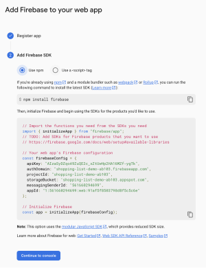

# Chat App Demo

Group Chat app built with React Native and Firestore database cloud storage.

## APP DEPLOYMENT SETUP

1.  ```nvm install 16.19.0```
    ```nvm use 16.19.0```
2.  ```npm install -g expo-cli```
3.  Create an expo account at https://expo.dev/signup, use
    ```expo login``` and follow credential process

4.  Clone and enter repo, enter command ```npx expo start``` and use either a mobile phone's 'Expo Go' app (from the app store), OR use an emulator (Android Studio) to simulate a mobile phone. To initialize your own database, proceed to the next section...

## FIRESTORE DATABASE SETUP

In order to test a new database, enter the repository on your device and follow these steps

1. https://console.firebase.google.com/ sign up or log in to create a firestore database

2. Create a project and under the 'Project Settings' (cog wheel) go to the 'General' tab, and find a selection called 'Your apps.'

3. Generate a configuration for 'Firestore for Web' (may be shown as the </> icon). Follow the steps to add Firebase to your web app. This will generaste a config. code that will be used to wirelessly connect the app to the database.



4. Copy and paste the text within the ```FirebaseConfig``` variable in the web page and replace the text within the ```FirebaseConfig``` variable that is in the ```App.js``` file. Rerun the app using ```npx expo start``` and enter a name to sign in and begin adding messages or photos to the database!
